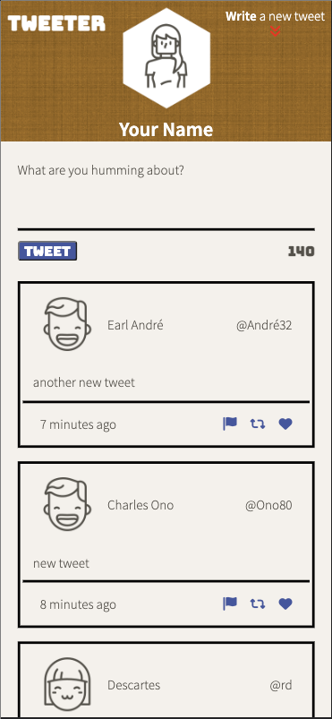

# Tweeter Project

Tweeter is a simple, single-page Twitter clone.

The purpose of this project was to practice front-end web design. It is a single page AJAX-based twitter clone that uses jQuery, HTML5 & CSS and a bootcamp supplied Node, Express server back-end. It incorporates responsive design to present different layouts for mobile, tablet, and laptop/desktop sized browsers.

## Final Product

### Mobile Version

### Tablet Version

### Desktop Version

## Dependencies

- Express
- Node 5.10.x or above
- Bodyparser
- Chance
- md5

## Getting Started

1. Clone your repository onto your local device.
2. Install dependencies using the `npm install` command.
3. Start the web server using the `npm run local` command. The app will be served at <http://localhost:8080/>.
4. Go to <http://localhost:8080/> in your browser.

## Features

On load, the browser will send a request to the Express server for the starter tweets that are held in the server files. The user can then click on the 'Write a new tweet' button to expose the tweet composition form. The button to expose the form does include animation as an additional feature.

jQuery is used to update the tweet character length counter and will provide appropriate error messages if the tweet is empty or is over the 140 character limit.

Once a tweet has been submitted, jQuerry is used to validate the tweet and then send an AJAX POST request to the server to add the tweet to the in memory database of tweets. Upon successful POST request the list of tweets displayed will be updated to include the recently submitted tweet.

Another addition for this project is a dynamic 'to top' button that appears as the user scrolls and goes away if the user scrolls back to the top. Pressing the button will bring the user back to the top of the page and bring the tweet composition form into focus.